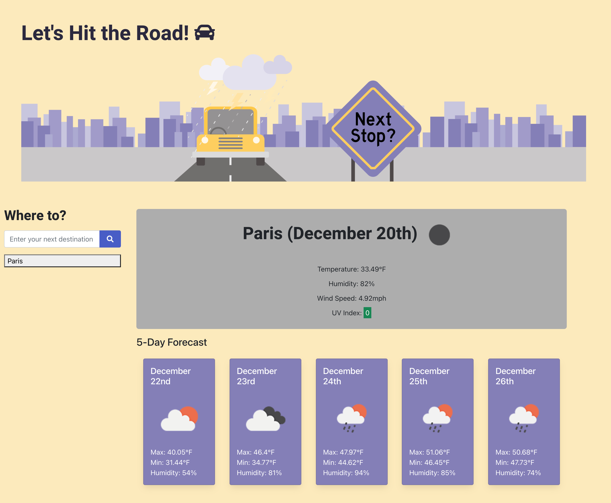

# Weather Dashboard - Let's Hit the Road

## Description

The goal of this application was to incorporate the OpenWeather One Call API into a website in order to retrieve weather data for cities. The user can input any city they are thinking of taking a road trip to and then the current weather conditions of the city will populate on the website. In addition to the current weather, the current UV index is shown, indicating by color, whether the conditions are favorable, moderate, or severe. Below the current conditions, a five-day weather forecast populates for that city. In order to allow users to compare the weather of different cities, local storage saves the previous cities and they can be accessed again by just clicking on the button. 

## Table of Contents

- [Installation](#installation)
- [Usage](#usage)
- [Credits](#credits)
- [License](#license)

## Installation

Installation for this website is done by clicking the link at: https://lferrett.github.io/weather_dashboard/

## Usage

This website can be accessed by visiting: https://lferrett.github.io/weather_dashboard

A screenshot of the final product is below:

## Credits

Coding and graphics were created by Lauren Ferrett, using references from class activities, as well as reference materials contained on: https://www.w3schools.com/js/ and https://developer.mozilla.org/en-US/docs/Web/JavaScript. Additional support materials used from: https://stackoverflow.com/questions/8294465/making-enter-key-on-an-html-form-submit-instead-of-activating-button.

## License

MIT License

Copyright (c) 2021 Lauren Ferrett

Permission is hereby granted, free of charge, to any person obtaining a copy
of this software and associated documentation files (the "Software"), to deal
in the Software without restriction, including without limitation the rights
to use, copy, modify, merge, publish, distribute, sublicense, and/or sell
copies of the Software, and to permit persons to whom the Software is
furnished to do so, subject to the following conditions:

The above copyright notice and this permission notice shall be included in all
copies or substantial portions of the Software.

THE SOFTWARE IS PROVIDED "AS IS", WITHOUT WARRANTY OF ANY KIND, EXPRESS OR
IMPLIED, INCLUDING BUT NOT LIMITED TO THE WARRANTIES OF MERCHANTABILITY,
FITNESS FOR A PARTICULAR PURPOSE AND NONINFRINGEMENT. IN NO EVENT SHALL THE
AUTHORS OR COPYRIGHT HOLDERS BE LIABLE FOR ANY CLAIM, DAMAGES OR OTHER
LIABILITY, WHETHER IN AN ACTION OF CONTRACT, TORT OR OTHERWISE, ARISING FROM,
OUT OF OR IN CONNECTION WITH THE SOFTWARE OR THE USE OR OTHER DEALINGS IN THE
SOFTWARE.